<div align="center">



**Paste any Steve agent wallet. See which trades actually count — read straight from Solana mainnet.**

[](https://arena-brief-ten.vercel.app)
[](https://steve.oobeprotocol.ai)
[](https://solscan.io)


</div>

> The Arena's rules say trades are "verified automatically through your Steve Agent" — but a
> competitor can't see that check until judging. Arena Brief runs the same kind of check in the
> open, for anyone, on any wallet, with no sign-in.

## Why

The Steve Agent Arena has four gates. Three are easy to self-report. The fourth — five qualifying
trades — has rules that are easy to get wrong: Jupiter and MagicBlock swaps must be at least
20 USDC, perps count at any size, the trade must be signed by the agent wallet, and artificial loops
are excluded. People find out at verification time, after the window has closed.

Arena Brief reads every transaction a wallet signed since the window opened, classifies it by the
programs the Solana runtime actually invoked, sizes it from real balance deltas, and flags the
patterns the rules exclude — before a judge does.

## Try it

- **Any wallet:** [arena-brief-ten.vercel.app](https://arena-brief-ten.vercel.app) → **Verify**, paste an address
- **Share a result:** `https://arena-brief-ten.vercel.app/?wallet=<address>` opens straight on the check
- **Your own desk:** the Brief, Ops, Trades and Dispatch tabs track gates, XP, missions and draft
  the X post and Superteam submission (stored in your browser)

## What it reads

| Venue | Program | How it is counted |
| --- | --- | --- |
| Jupiter | `JUP6LkbZbjS1jKKwapdHNy74zcZ3tLUZoi5QNyVTaV4`, order engine `61DFfeTKM7trxYcPQCM78bJ794ddZprZpAwAnLiwTpYH` | Swap ≥ 20 USDC, sized from the USDC/USDT leg, else the SOL leg |
| MagicBlock | `SPLxh1LVZzEkX99H6rqYizhytLWPZVV296zyYDPagv2` | Jupiter route + e-SPL = private swap (≥ 20 USDC). e-SPL alone = private transfer (mission, not a trade) |
| Phoenix Perps | `EtrnLzgbS7nMMy5fbD42kXiUzGg8XQzJ972Xtk1cjWih` | Decoded from instruction bytes (codes from Ellipsis Labs' [Rise SDK](https://github.com/Ellipsis-Labs/rise-public)). Market/limit orders count at any size; `RegisterTrader`, deposits, withdrawals, cancels and stop placements do not |
| Adrena | `13gDzEXCdocbj8iAiqrScGo47NiSuYENGsRqi3SEAwet` | Counts when a `*Position*` instruction runs |

Program IDs were checked against live mainnet traffic on 27 Sep 2026. Jupiter and Phoenix Perps
were settling transactions every few seconds. **Adrena's most recent transaction was ~28 hours
old and was staking, not trading** — the protocol is winding down, so plan perps on Phoenix.

## Real vs. simulated

| Part | Status |
| --- | --- |
| Transaction history, signer check, program detection | **Real** — Solana RPC, finalized commitment |
| Swap size from a USDC/USDT leg | **Real** — on-chain token balance deltas |
| Swap size from a SOL-only leg | **Approximate** — priced at the SOL price *at lookup time* (Jupiter price API), marked `*` in the UI |
| Phoenix Perps order vs. setup / collateral | **Real** — decoded from instruction data. Perp *size* is not shown: collateral sits in program accounts |
| Loop detection | **Heuristic** — same pair reversed at ±10% size within 10 minutes |
| Arena XP, missions, X post | **Self-reported** in the desk — the Arena does not expose them publicly |
| Final eligibility | **The Arena's own telemetry.** This is an independent check, not the official one |

## Architecture

```
 browser ── Verify tab ──► createServerFn verifyWallet(wallet)
                                 │
                                 ├─► getSignaturesForAddress   (since 2 Sep, ≤ 400)
                                 ├─► arena_tx cache ──hit──► skip RPC (finalized txs never change)
                                 ├─► getTransaction ×N         (bounded concurrency, 429 back-off)
                                 │        │
                                 │        ▼
                                 │   classifyTx()  pure, no I/O
                                 │     signer? → programs invoked → balance deltas
                                 │     → venue · kind · size · qualifies · reason
                                 │
                                 ├─► flagRoundTrips() → summarize()
                                 └─► arena_wallet upsert ──► "Recently verified"
```

A database outage never breaks a lookup: the cache is optional and the check falls back to live
RPC.

## Tech stack

| Layer | Choice |
| --- | --- |
| App | React 19, TanStack Start (SSR + server functions), Tailwind v4, Zustand |
| Chain | Solana JSON-RPC (`jsonParsed`), Helius or any RPC via env |
| Data | Neon Postgres via `pg`; PGLite in local dev |
| Hosting | Vercel (Nitro `vercel` preset), git-push deploys |

## Flow

1. Paste a wallet (or open a `?wallet=` link).
2. The server pulls every signature since 2 Sep and fetches only the ones it has not classified.
3. Each transaction is checked: signed by the wallet, not failed, which Arena programs ran.
4. Swaps are sized from the stable leg, or the SOL leg at current price when there is none.
5. Fast same-size reversals are flagged and dropped from the count.
6. **This is my agent** saves the wallet; the trades gate then reads the on-chain count.

## Local development

```bash
npm install
npm run dev -- --port 5175     # the default 8080 is reserved in the scaffold
```

Without `DATABASE_URL`, dev uses an in-memory PGLite. Run the classifier tests against real
captured mainnet transactions:

```bash
node --experimental-strip-types --test src/lib/chain/classify.test.ts
```

## Deployment

Vercel project settings: Framework **Other**, Build Command `npm run build`, Output Directory
**not overridden** (Nitro writes `.vercel/output`).

| Variable | Purpose |
| --- | --- |
| `DATABASE_URL` | Neon **pooled** connection string. Migrations in `migrations/*.sql` apply on every build |
| `HELIUS_API_KEY` | Recommended. The public RPC works but is limited to ~20 new transactions per lookup |
| `SOLANA_RPC_URL` | Optional. Any RPC URL; overrides the Helius key |

`migrations/auth/` is an opt-in sign-in schema that is intentionally **not** applied — the app has
no accounts.

## Attribution

Independent community tool. Not affiliated with OOBE Protocol or Superteam. Trades still execute
through your Steve Agent wallet; this only reads the chain.
